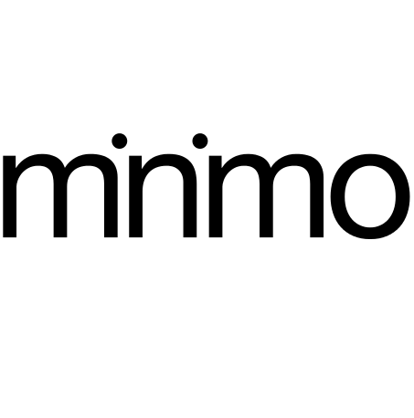

<p style="text-align:center">
    
</p>

### Proposta

-----

<p class="lead">
___PROJECT_NAME___
</p>

<div class="columns">
    <div class="one-half column centered">

___CITY___, ___DATE___\
Cliente: **___CLIENT_NAME___**\
A/C: **___RECIPIENTS___**
    </div>
</div>

<div style="page-break-before: always;" />

Resumo
------

- Desenvolvimento de um sistema mínimo viável para suporte, que conecte usuários e atendentes por vídeo chamadas.
- Infra estrutura para conexão de pares por WebRTC, interface de usuário das vídeo chamadas, gravação e arquivamento das chamadas será fornecido por um serviço terceirizado: [TokBox][tokbox]
   - Integração dos sistemas tanto clientes quanto servidor com as APIs do Tokbox
- Sistema contém 3 componentes principais:
    - widget de vídeo chat embutível para páginas web
    - web app móvel de vídeo chat para os profissionais de suporte
    - servidor backend responsável por fazer a conexão entre usuários e atendentes.
- Código fonte licenciado em licença open source ([The MIT License][mit]).

---

### Preços e prazos

- Valor total: <mark>___TOTAL_VALUE___</mark>
- Duração total: ___DURATION___
<br>

---

### Validade
Este orçamento é válido até o dia ___EXPIRATION_DATE___.

[mit]: ___LICENSE_URL___
[tokbox]: ___API_URL___

<div style="page-break-before: always;" />

Proposta detalhada
------------------

### 1. Sobre os componentes do sistema

Este projeto prevê o desenvolvimento de 3 componentes principais: dois clientes de vídeo-chat em HTML/Javascript, um para ser embutido em páginas voltadas para o consumidor final (widget) e um outro cliente também em tecnologias web que funcione como uma app de celular para uso dos atendentes (webapp), o terceiro componente é o servidor que mantém o controle das listas de atendentes junto ao estado de disponibilidade deles, e que gerencia e conecta as duas pontas de cada chat. Abaixo uma descrição mais detalhada de cada um desses componentes.

#### 1.1 Widget de chat

##### 1.1.1 Interface de usuário

Uma página simples contendo um formulário pedindo nome, email e telefone do consumidor e um botão para iniciar chamada.

Uma tela de espera para enquanto a busca por um atendente estiver sendo feita.

Uma tela de erro caso a conexão falhe.

Interface de vídeo chamada fornecida pela biblioteca TokBox caso uma conexão entre consumidor e atendente seja feita com sucesso.

##### 1.1.2 Integração com o gerenciador de conexões

Após clicado o botão de iniciar chamada, o widget faz uma conferencia básica nos campos do formulário para certificar que nenhum deles está vazio.

Então uma requisição ao gerenciador de conexões é aberta, enviando os dados do consumidor e o widget passa para a tela de espera enquanto aguarda o servidor encontrar um atendente disponível.

Mensagem de erro caso o servidor esteja fora do ar ou no caso de todos os atendentes estarem ocupados.

##### 1.1.3 Instalação do widget por parte do lojista em seu site

A instalação deve ser simples, colar um pedaço de código javascript em seu site, incluindo alguns parametros únicos daquela instlação, como um id e a lista de subgrupos de atendentes caso um site contenha múltiplas filiais ou areas ou grupos de atendentes diferentes.

#### 1.2 Web App de chat

##### 1.2.1 Interface de usuário

Uma tela para que o atendente manualmente avise se está ou não disponível para receber chamadas.

Uma notificação intrusiva, similar à de uma chamada telefonica, que "acorde" o telefone quando ele receber uma ligação.

Uma tela para escolher entre atender o chamado ou repassar para outro atendente da fila.

Interface de vídeo chamada fornecida pela biblioteca TokBox caso a conexão com o consumidor seja feita com sucesso.

Uma tela de erro para os casos da conexão ser interrompida ou falhar por outros motivos.

##### 1.2.2 Integração com o gerenciador de conexões

A web app deve suportar algum tipo de push notification vinda do servidor, mesmo estando em background.

Ao receber uma notificação do servidor ela deve aguardar o atendente aceitar o chamado e então enviar um chamado para que o servidor termine de conectar as duas pontas e mude o status do atendente para ocupado em sua lista.

Ao finalizar uma chamada a web-app deve avisar o servidor que aquele atendente se encontra disponível novamente.

Mudanças manuais de estado do atendente de disponível para não-disponível e vice-versa devem ser comunicadas ao servidor.

##### 1.2.3 Instalação da webapp por parte do atendente

O atendente recebe do lojista uma url para baixar a app, junto com um código único para ser usado como seu login.

##### 1.2.3 Tecnologias / stack da webapp

A app é majoritariamente desenvolvida em Javascript, feita para funcionar em navegadores móveis modernos. E a "instalação" na home-screen de um didpositivo móvel é feita como a de um bookmark. Isso trás a vantagem de poder funcionar em múltiplas plataformas, poder rodar sempre a versão mais recente do código e não necessitar aprovação em nenhuma "App Store" proprietária.

Mas alguns dos recursos, como a notificação intrusiva de chamada, por exemplo, podem não estar disponíveis através de Web APIs padronizadas e portanto uma versão "encapsulada"/híbrida feita com o framework Cordova para a plataforma Android poderá ser disponibilizada nesse caso.

#### 1.3 Servidor gerenciador de conexões

O servidor deve manter uma lista de atendentes, divididos por lojas e subgrupos, que são todos os logins únicos das pessoas autorizadas a utilizar o sistema como um atendente.

A princípio esta lista é cadastrada manualmente via um arquivo de configuração.

O servidor não deve permitir que um atendente cadastrado em uma loja e um subgrupo receba chamados de outras lojas ou outros subgrupos.

O servidor deve disponibilizar uma API http para que os atendentes possam comunicar seu status atual: disponível, não disponível.

O servidor deve ser capaz de enviar notificações de chamadas para atendentes disponíveis. Essas notificações devem conter os dados necessários para que a webapp conecte com o widget via Tokbox (tokens, etc).

O servidor deve possuir uma lógica de fila e rotação entre os atendentes disponíveis, para que o próximo da fila seja chamado caso o primeiro demore para atender ou perca a conexão.

O servidor deve disponibilizar uma API para que os widgets possam requisitar vídeo chamadas.

O servidor deve efetuar algumas validações básicas para identificar que uma requisição veio de um site/widget autorizado.

##### 1.3.1 Sobre a tecnologia / stack do servidor

Aplicação baseada em Node.js capaz de rodar em máquinas linux ou plataformas de cloud compatíveis com node/npm (exemplo: Heroku). Todas as bibliotecas e dependências externas instaláveis devem possuir código fonte aberto e licenças de uso compatíveis.

<div style="page-break-before: always;" />

### 2. Cronograma / Preços

 - 1. Escrita e aprovação deste documento
    - ___TIME_1___, ___PRICE_1___
 - 2. Prova de conceito de web-app capaz de "acordar" e "tocar" com uma notificação.
    - ___TIME_2___, ___PRICE_2___
 - 3. Prova de conceito mínima de Widget + Webapp que conversem com as credenciais fixas hardcoded, sem o gerenciador de conexões de intermediário.
    - ___TIME_3___, ___PRICE_3___
 - 4. API do servidor
    - ___TIME_4___, ___PRICE_4___
 - 5. Primeira Release, com os 3 componentes conversando
    - ___TIME_5___, ___PRICE_5___
 - 6. Testes e catalogo de bugs
    - ___TIME_6___, ___PRICE_6___
 - 7. Segunda Release, MVP, com alguns dos principais bug-fixes
    - ___TIME_7___, ___PRICE_7___

Total: ___DURATION___, ___TOTAL_VALUE___ 

#### 2.1. Opções proprietárias

Todos os preços acima são para o desenvolvimento de um código com licença livre, em repósitório git público. Caso necessite de um período de exclusividade onde o desenvolvimento e o código seja fechados / proprietários, adicione ___CLOSED_RATE___ ao valor por mês de exclusividade após o lançamento.

**Exemplo** Para ter todo o desenvolvimento em repositório git privado e mais uma janela de exclusividade de 3 meses após a entrega da release final cálculo do preço é ```(1 + 3 * ___CLOSED_RATE_NUM___) * ___TOTAL_VALUE___ = ___CLOSED_PRICE_EXAMPLE___```

Para períodos de exclusividade maiores que um ano, ou para uma licença fechada premanente entre em contato.


